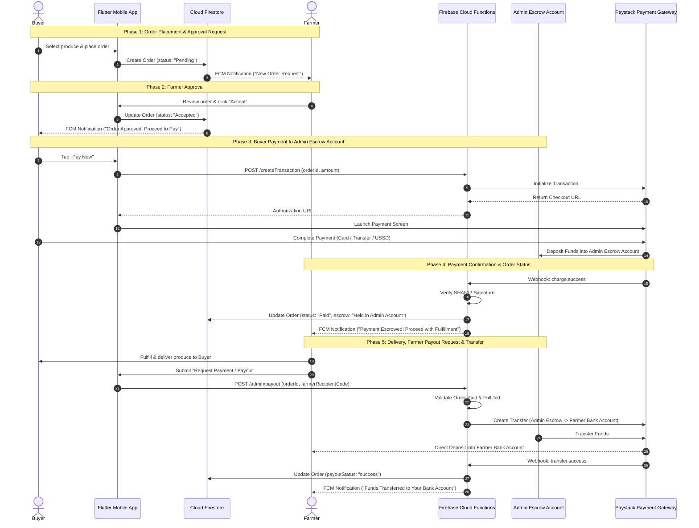

# MarketPlace 🌱

A comprehensive, dual-sided Flutter mobile application connecting **Farmers** and **Buyers**. MarketPlace leverages modern cloud architecture, on-device machine learning, IoT hardware streaming, and direct payment gateway integration to deliver a complete agricultural trading and crop diagnostic ecosystem.

---

## 🚀 Key Features

### 👨‍🌾 Farmer Dashboard & Tools
- **Crop Disease Detection & ESP32 Camera Stream:** Live MJPEG stream integration with ESP32-CAM devices, image capture from camera/gallery, and instant on-device AI diagnostic analysis using MobileNetV3 / TensorFlow Lite.
- **Product Inventory Management:** Easily list, update, and manage produce, stock quantities, and pricing.
- **Order Approval System:** Review buyer order requests, accept or manage pending orders, and track order fulfillment statuses.
- **Clean Modern Interface:** Unified white & green thematic UI across all farmer management pages.

### 🛒 Buyer Marketplace & Cart
- **Produce Discovery:** Browse, filter, search, and bookmark favorite farmers.
- **Flexible Cart & Multi-Order Management:** Grouped order management (*Cart Items*, *Pending Approval*, *Ready for Payment*, and *Paid Orders*).
- **Bulk Checkout & Paystack Integration:** Paystack payment integration supporting single or bulk checkout with real-time status updates.
- **Smart Profile & Email Validation:** Ensures phone-authenticated buyers have an active email address registered for Paystack receipt delivery, seamlessly guiding profile updates and auto-resuming checkout.

### 🤖 AI, Support & Communication
- **Generative AI Assistant (Gemini API):** Smart AI assistant providing crop advice, market trends, and automated guidance.
- **Real-Time Support & Chat:** Direct buyer-farmer messaging and ticket-based support system.
- **Push Notifications:** Firebase Cloud Messaging (FCM) alerts for order status changes and product listings.

---

## 💳 Payment & Escrow Workflow

1. **Approval Request:** The buyer adds an item to their cart and requests approval.
2. **Farmer Approval:** The farmer reviews and accepts/approves the order request.
3. **Escrow Payment:** The buyer pays via Paystack; funds are securely deposited into the **Central Admin Escrow Account**.
4. **Payment Confirmation:** Paystack webhook verifies payment, updates Firestore order status (`Paid`), and alerts the farmer to fulfill the order.
5. **Farmer Payout Request:** Upon order fulfillment, the farmer submits a payout request through the app.
6. **Fund Transfer:** Cloud Functions / Paystack Transfer API executes the payout, transferring funds from the Admin Escrow Account directly into the **Farmer's Bank Account**.

### Sequence Diagram



---

## 🛠️ Tech Stack

- **Frontend:** [Flutter](https://flutter.dev/) & Dart
- **Backend as a Service:** [Firebase](https://firebase.google.com/) (Authentication, Cloud Firestore, Firebase Storage, FCM)
- **Payment Gateway:** [Paystack API](https://paystack.com/) & Firebase Cloud Functions
- **On-Device Machine Learning:** TensorFlow Lite (`tflite_flutter`) with MobileNetV3 model
- **IoT & Video Stream:** ESP32-CAM MJPEG HTTP Streaming (`flutter_mjpeg`)
- **AI Engine:** Google Gemini API (`google_generative_ai`)
- **Environment Management:** `flutter_dotenv`

---

## 📁 Project Structure

```text
lib/
├── Auth/                      # Authentication (Phone, Google, Facebook, Login/Signup)
├── Homepage/                  # Main navigation shell and home pages
├── models/                    # Data models (OrderModel, Product, UserProfile, etc.)
├── screens/                   # Shared screens (Cart, Order Detail, AI Chat, Support)
├── screens_buyer/             # Buyer interface (Marketplace, Favorites, Profile)
├── screens_farmer/            # Farmer interface (ESP32 Camera Detection, Inventory)
├── services/                  # Business logic (Order, Paystack, ML, Notifications)
└── theme.dart                 # App design system & color palettes
functions/                     # Firebase Cloud Functions (Paystack transactions & webhooks)
```

---

## ⚙️ Setup & Environment Configuration

### Prerequisites
- [Flutter SDK](https://docs.flutter.dev/get-started/install) (v3.9.2 or higher)
- [Dart SDK](https://dart.dev/get-dart)
- Active Firebase Project with Auth, Firestore, and Storage enabled
- Paystack Developer Account (Test or Live API Keys)

### 1. Environment File (`.env`)
Create a `.env` file in the root directory:

```env
# Gemini AI
GOOGLE_API_KEY="your_gemini_api_key"

# Firebase Config
FIREBASE_WEB_API_KEY="your_web_api_key"
FIREBASE_WEB_APP_ID="your_web_app_id"
FIREBASE_ANDROID_API_KEY="your_android_api_key"
FIREBASE_ANDROID_APP_ID="your_android_app_id"

# Paystack Payment Gateway
PAYSTACK_SECRET_KEY="sk_test_xxx"
PAYSTACK_PUBLIC_KEY="pk_test_xxx"
PAYSTACK_CALLBACK_URL="https://standard.paystack.co/close"

# Optional Cloud Functions API URL
FUNCTIONS_API_BASE_URL=""
```

### 2. Installation & Execution

```bash
# Clone the repository
git clone https://github.com/jaguarpawjr/MarketPlace.git
cd MarketPlace

# Install dependencies
flutter pub get

# Run the app
flutter run
```

---

## 🤝 Contributing

Contributions are welcome! Feel free to open an issue or submit a pull request for new features, bug fixes, or enhancements.

## 📄 License

This project is licensed under the MIT License.
